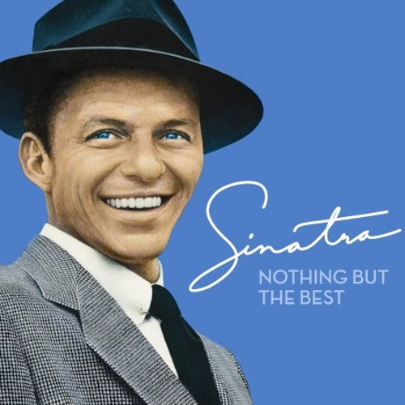

# Chapters 9-18 notes

Nat literally dont give a fuck that medea killed her brother

Circe is the queen of projection because she projects Glaucos onto Medea's relationship

Medea drugs Jason to talk to Circe, but does she have him under a spell in the first place?
(Nat is lacking the sufficient textual evidence for this claim)
- But is sufficient in women's intuition and vibes - nat 

Nat is relating this to Minos and Circes sister - witchcraft is the only way that
women can have control over men

Landrie knows the bag of winds from the spongebob movie

(Nat has never seen the spongebob movie...)

Odysseus gets the favor of the gods to sail with the crew (but the crew is stupid and opens
the bag of winds)

## The kinds of men that Circe is into

Circe likes a blue collar man (cuts, bruises, stories, wtv)

Nat understands her

"if a man is a little bloody, .." "they're passionate"

"doesn't even have to be that. OR, watching men get beat up"

"SO we're talking personally"

"no I just understand her a little"

"well actually I do because i was really annoyed by how chris would always
complain about 'my hands are so smooth' go pick up a piece of wood"

Pro circe liking beat up men - Nat

Is it freudian because she sees prometheus like a father figure? - Aidan

Prometheus talks about her pain and she becomes fascinated with feeling pain
and healing from it, question mark? - Landrie

```
in emotionally abusive situations, our thought process is like I wish
you had just hit me so that I could have the physical pain instead
of the emotional pain
```
A little from my dark twisted mind - nat

Circe was going through it worrying about her son lowkey

She has this fascination with pain because she can only experience it internally,
emotionally, but doesn't have the external 'proof' and her family is also
gaslighting her the whole time

When the men started showing up, Landrie was all like 'actually fuck human men like,
women can't have their own houses?'

The sheep is symbolic for Circe's choice - the men initially want to come to kill them,
but later Circe chooses to give the lamb to Odysseus for her journey

## Circe is so lonely but really likes odysseus

When the lion dies, she loses self confidence and her loneliness is more obvious to her

Why does Athena want the kid dead? Oh right, its odysseus's son (her favorite mortal)

Nat is unsure if the son issue is really about Odysseus (but landrie is pretty sure)

\(In the mythology, Telegonus is destined to kill Odysseus. See 
[this](https://en.wikipedia.org/wiki/Telegonus_(son_of_Odysseus) \)

Ronan does not credit women

## Various uses of symbolism

Nat has more to say about the sheep symbolism - any sort of livestock mentioned has
to do with power and wealth - think Circe's dad being obsessed with the cows, but
Jason steals golden fleece from aeetes. (Yes the golden fleece is magical but it is
sheep's wool).

What Nat knows about the fleece is through Percey Jackson lol. The golden fleece is
magical and it can bring anything back to life. It percey jackson they (the bad guys)
use the golden fleece to bring back Chronos, but then percey jackson want to use it
to do something else. They are using the golden fleece to heal the wound of their friend
(the one that got turned into a tree)

SO assuming that rick riordan wasnt making some shit up, Nat would understand why
he would want to protect the fleece because out of a god's hands into a mortal's
hands, it is contradictory to a mortals story.

This also has parallels to Prometheus (stealing something from the gods and giving
it to the humans)

[golden fleece wikipedia page](https://en.wikipedia.org/wiki/Golden_Fleece)

(nat) Interpretation that it [the fleece] is magical is not in every piece of
Greek mythology, and it is unclear when it was interpreted as magical. But, the fleece
is a symbol of authority and divine right to rule

## Taking care of men (and sometimes women)

When circe is going through the struggles of being a mom to a mortal kid, she says
"this is the child I deserve" (which is wild for Circe) - Landrie 

Not like taking care of mortal men lol

The guy falling off the roof was a little on the nose, like come on Madeline Miller

Circe's brother totally sucks and he abandons her as soon as she isn't useful to him anymore

And alsos circe's sister for just kicking her out after she helps her give birth

(and also the nymphs they're lowkey so mean)

(ronan) circe eventually learns to evaluate characters and she can't really turn away
everyone that comes to her, though.

Will circe's son have witch's power? idk

## Back to freud

Circe has this obsession with pain (see before)

But she also has an obsession with helping people and feeling wanted through acts
of service (and sex), and reaffirming herself through that - nat

This starts with prometheus, really. Prometheus couldn't escape his fate either

(Landrie) is surprised; because of her lonely state, she knew Athena would be all
'oh if u give your son over now, I'll be your friend'. In the moment, she was surprised
that Circe didn't accept it.

The gods cant understand Circe's care for mortals (Glaucos, Daedalus's men, Odysseus's men,
and her son)

## Overall book thoughts

We like it so far

NAt stands by her note - "it's just like adulthood, for real"

Aidan doesn't really relate to child rearing..

but ronan has really big boobs

(EDIT) ronan double fisting a ladys boobs

"Women are bisnatches" (ronan)

"I said bisnatches. Its more polite"

Circe and Pasiphae could've been friends, but the patriarchy

# New york new york



There was a shooting like 15 minute walk away from ronan but ronan didn't go closer

There was a helicopter flying over within view but far away

He checked the citizen app and someone got shot or something. Outside

It's a guy who raises pidgeons (that got shot)

Landrie says that pidgeon lady dies (shot? stabbing?)

[No she was beaten to death with a stick](https://abc7ny.com/post/central-park-murder-63-year-old-woman-beaten-death-stick-remembered-friends-members-birding-community/19884619/)

Devlin says that ronan's chances of getting shot are very, very low.

Ronan nobody is going to stab you i promise

But ronan says he'll let us know

You lowkey gotta pay attention when you walking around in new york

Nat will keep headphones in but won't play music because then people won't go up to talk to her

If you do random hand signals at people like you're deaf they'll go away

Also nat's cousin told her that, before she moved to boston, the cousin was like 'you can tell
which homeless people are homeless and which ones are drug addicts, because the ones that approach
you asking for money are drug addicts'

When landrie was in line at a concert (afterwards to sign her stuff) landries mom annd sister
said there were two people opening the door for you but they would only let you in if you
give them a dollar

## Last thoughts

Ronan just joined a rock climbing gym

Landrie asks ronan if he shoves his feet in those tiny little grooves

Ronan doesn't like doing it alone though
